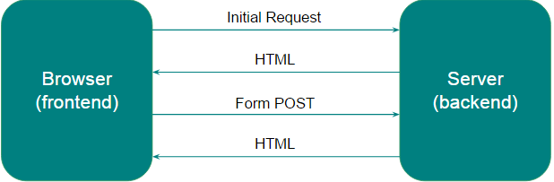
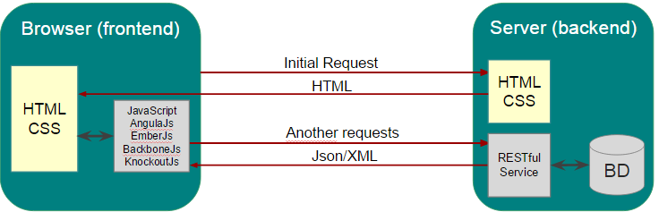
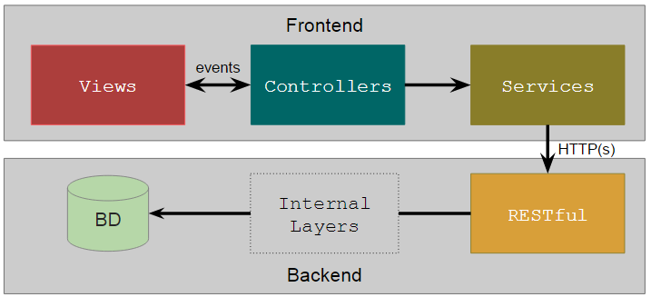

 
#AngularJs Reference Architecture

1. [Goals](#Goals)
1. [Foundations](#Foundations)
1. [Target](#Target)
1. [Overview](#Overview)
    1. [Traditional Model](#Traditional-Model)
    1. [SPA Model](#SPA-Model)
1. [Logic View](#Logic-View)
    1. [Views](#Views)
    1. [Controllers](#Controllers)
    1. [Services](#Services)
1. [Code Structure](#Code-Structure)
    1. [General Resources](#General-Resources)
    1. [Foundation Structure](#Foundation-Structure)
    1. [Module Structure](#Module-Structure)
1. [Patterns and Restrictions](#Patterns-and-Restrictions)
    1. [General](#General)
    1. [Controllers](#Controllers)
    1. [Services](#Services)
    1. [Views](#Views)
    1. [Directives](#Directives)
    1. [Filters](#Filters)
1. [Recommended Tools](#Recommended-Tools)
    1. [Dependency Management - Bower vs npm](#Dependency-Management)
    1. [Build and Deploy](#Build-and-Deploy)
    1. [Automated Tests](#Automated-Tests)
    1. [Code Generation](#Code-Generation)
    1. [Mocks](#Mocks)
    1. [Debugging](#Debugging)
1. [Components](#Components)

##<a name="Goals"></a>Goals

Provide guidance and recommendations on the tools, best practices, standards, constraints and solution design that can/should be used to develop an application SPA (Single Page Application) with angularjs.

##<a name="Foundations"></a>Foundations

* Promoting productivity for projects
* Standardize SPA applications
* Facilitate the training of teams
* Adoption of standards and market practices

##<a name="Target"></a>Target
Mainly applications with AngularJS SPA, since it is more widespread, stable and evolving. Presented techniques can mostly be adopted in other frameworks SPA or even Web applications.

##<a name="Overview"></a>Overview

###<a name="Traditional-Model"></a>Traditional Model



In this traditional model the navigation between pages, occurred in the browser, request or send data waiting to return a new HTML to be rendered on top of the current page, even in situations where the request to stay on the same page. Usually this HTML is prepared dynamically in the web application server.

Frameworks like JSF, Spring MVC, ASP.NET MVC, django, Play, Rails, among others, use this building model.

###<a name="SPA-Model"></a>SPA Model



In the SPA model, the HTML page requests are smaller, are held when have a page change, though is returned static HTMLs unprepared adds the application server. Data is exchanged (sent or received from the server) through AJAX requests in REST APIs in JSON or XML format.

This model basically consists of three core technologies:
* HTML: pages or page fragment
* JavaScript: controllers and other programmatic resources
* CSS: visual stylesheet

There are some frameworks that implements this model (Ember, knockout, Backbone.js, etc), but recommended, as stated above, is to use AngularJS.

##<a name="Logic-View"></a>Logic View



In SPA applications the recommendation is the adoption of the above model, basically adopt the MVC pattern on the client side, separating and organizing code responsibility.

AngularJS already directs the construction for this MVC pattern and has components acting types in each of these layers.

###<a name="Views"></a>Views

Layer where is the implementation of the canvas and visual components. In this layer we find the following AngularJS components/resources:

* HTML/Templates
* Data Binds
* Directives
* Filters

###<a name="Controllers"></a>Controllers

Layer where is the implementation of flow controllers and navigation between screens. In this layer we find the following AngularJS components/resources:

* Controller
* Router and Location

###<a name="Services"></a>Services
Layer where is the implementation of services, with business rules (when there is no backend) or calls to the backend. In this layer we find the following AngularJS components/resources:

* Service
* Factory
* Provider

##<a name="Code-Structure"></a>Code Structure

Following is the base organization proposed for SPA projects, based on industry standards and evolved with an increase of certain individual divisions.

Base reference: https://scotch.io/tutorials/angularjs-best-practices-directory-structure

###<a name="General-Resources"></a>General Resources

```
assets --> external components or code implementation is not linked to SPA
assets\libs --> external libraries (ex: angular, jquery, bootstrap, etc)
assets\css --> third-party css
assets\css\app.css --> custom css in the project (the only one that must be modified)
assets\fonts --> sources used by the project
assets\img --> images used in assembling the site/project
assets\js --> JS files not AngularJS created/customized in the project
```

This structure is used by several market components, for example, Twitter Bootstrap uses these folder paths on their CSS, to obtain images, fonts, etc.

###<a name="Foundation-Structure"></a>Foundation Structure

```
app --> SPA application components
app\app.js --> JS file with general application settings
app\common --> foundation technical module, containing general components of the app
app\common\env\common-env.js --> json file with general environment variables
app\common\i18n\resources_[en|pt|*].js --> json file with resources for i18n
app\common\components --> specialized components and resources for the project
app\common\components\[component] --> organized by component, containing js, html...
app\common\components\[component]\[component].js
app\common\components\[component]\[component].html
app\common\components\header --> layout component for create the header
app\common\components\navigation --> layout component for create the menu
app\common\features\[submodule]\[feature] --> global features/layouts common of every project
	Suggested route: /common/[submodule]/[feature]
app\common\features\auth --> glogal screens related to authentication.
app\common\features\auth\signin --> sign in screen
	Route: /common/auth/signin
app\common\features\auth\signup --> sign up screen
	Route: /common/auth/signup
```

###<a name="Module-Structure"></a>Module Structure

```
app\[module]
app\[module]\[module]-app.js --> js file with module settings
app\[module]\env\[module]-env.js --> json file with module environment variables
app\[module]\i18n\resources_[en|pt|*].js --> json file with resources for i18n
app\[module]\components\[component]\ --> specialized module components 
app\[module]\components\[component]\[component].js
app\[module]\components\[component]\[component].html
app\[module]\features\[submodule*]\[feature] --> module features/pages
	Rota recomendada: /[module]/[submodule]/[feature]
app\[module]\features\[submodule*]\[feature]\[feature]-ctrl.js --> controller
app\[module]\features\[submodule*]\[feature]\[feature]-service.js --> service
app\[module]\features\[submodule*]\[feature]\[feature]-directive.js --> directive
app\[module]\features\[submodule*]\[feature]\[feature]-filter.js --> filter
app\[module]\features\[submodule*]\[feature]\[feature].html --> page
app\[module]\features\[submodule*]\[feature]\[feature]\view\*.html --> if more than 1 html
```

In this template, it is proposed to separate reusable components of functional pages. Understood as components those common features or reusable mechanisms (directives, filters, interceptors in AngularJS)... Features, instead, would be the functional pages, where we have the HTML that makes up the whole page and its controller (and other pages specific resources).
The naming convention for folders and files is to use always lowercase. For js files you should always use the sulfix that indicate his type ex: myprofile-ctrl.js, myprofile-service.js, myprofile-directive.js, etc.

For components written in AngularJS, is recommended that the name has concatenation module and submodule, such as a package / namespace to prevent overlapping component names in different modules.

##<a name="Patterns-and-Restrictions"></a>Patterns and Restrictions

###<a name="General"></a>General
1. Always modify the scripts to support RequireJS, the module NodeJS or included directly in index.html. Ex.:
```javascript
(function (factory) {
    if (typeof define === 'function') {
        define(['myDep', ...], factory);
    } else {
        if (typeof module !== "undefined" && typeof exports !== "undefined" && module.exports === exports){
            module.exports = 'COMPONENT_NAME';
            require('myDep');
        }
        return factory();
    }
}(function() {
    // ...component code
}));
```

1. If you prefer, use the mechanism available in [ng-jedi-factory](https://github.com/jediproject/ng-jedi-factory) component, which performs this abstraction above implementation for encoding controllers, services, filters, directives, modal, etc.

1. Always include external dependencies using [Bower](http://bower.io/) and set it in main.js, at the shim block if the same is not coded to support RequireJS.
```shell
bower install [nome_dep] --save && grunt
```

1. Resources linked to a feature must be created in the feature folder of the structure
```javascript
app\[module]\features\[submodule*]\[feature]\[feature resources]
```

1. Components must be created in the structure below and should not be a full feature, but reusable resources in features/panels
```javascript
app\[module]\components\[component]\[component resources]
```

1. Third-party scripts should not be changed, instead try to create a new version and publish the bower, in the worst case customize and version in the assets folder **\js\**

1. Hardcoded values that represent directories or information that can be changed according to the environment, must be set in **[*module*]-**env.js of the specific module. The [ng-jedi-factory](https://github.com/jediproject/ng-jedi-factory) json component is loaded into envSettings variable and constant can be accessed as follows:
```javascript
envSettings[.module].[variable]
```

1. If there is internationalization requirements, use the mechanism [ng-jedi-i18n](https://github.com/jediproject/ng-jedi-i18n), including all text of the policy htmls [jd-i18n](https://github.com/jediproject/ng-jedi-i18n#translate) to enable later internationalization.

1. Methods, classes, variables, etc... always written in english language.

1. Methods names, parameters and variables always written using camelCase.

1. Resource name (controller, modal, service, etc.) always using PascalCase.

1. Every component/resource should use the default namespace:
```javascript
app.[module].[submodule].[feature*].[component] 
//e.g.: app.security.auth.userprofile.UserProfileCtrl
```

1. Always declare **'use strict';** at beginning of a js file

1. Names, folders and files aways should use lowercase.

1. Every AngularJS component should have the dependencies injected by name, avoid declare just the component constructor, since the minification will shorten the parameters names.

1. Use logs from the component [$log](https://docs.angularjs.org/api/ng/service/$log) instead of console.log.

1. Do not use the native js function *alert*, use the component [toastr](https://github.com/Foxandxss/angular-toastr) or [ng-jedi-dialogs](https://github.com/jediproject/ng-jedi-dialogs) instead, ex.: 
```javascript
toastr.success(“Message”); 
AlertHelper.addInfo(“Message”);
```

1. Every AngularJS script should be loaded by [module]-app.js of his module.

1. API's request exception should be treated by interceptors available at [$httpProvider.interceptors](https://docs.angularjs.org/api/ng/service/$http#interceptors) component. Exceptions involving javascript failures should utilize [$exceptionHandler](https://docs.angularjs.org/api/ng/service/$exceptionHandler).

###<a name="Controllers"></a>Controllers

1. Naming conventions:
  1. Physical folder: app\[**module**]\features\[**submodule\***]\[**feature**]\[**feature**]-ctrl.js
  1. Controller names: app.[**module**].[**submodule\***].[**feature**].[**feature**]Ctrl
  1. Model: [**feature**]Model
  
1. The controller's body should follow the declaration order:

  - Services
```javascript
 var service = SecurityRestService.all('admin/feature');
 ```
  - Viewmodel (vm) declaration
```javascript
 var vm = this;
```

  - Model declaration and further controls variables
```javascript
 vm.featureModel = { name: null };
 vm.pageSize = 0;
```

  - Methods bindings
```javascript
 vm.filter = filter;
 vm.remove = remove;
 vm.clear = clear;
```

  - Methods executions, data loading or any other initialization execution for the page
```javascript
 loadSystems(function (systems) {
        vm.featureRegistrationModel.systems = systems;
});
```

  - Methods declarations and his statements
```javascript
 function loadSystems(success) {
        console.log('Recovering systems');
        SecurityRestService.all('admin/system').getList().then(success);
}
```

1. Controllers should not have business rules, it should be created only in API's scope.
1. Controllers should not make direct API's calls, instead it should call by the service layer.
1. Services should not be exposed by vm or other attribute, it always should pass through controller methods.
1. All page attributes related to the model should be declared in the *vm.[**feature**]Model*, ex:
```javascript
vm.featureModel = { name: null };
```
1. Controller attributes should be declared in the root of the vm, ex:
```javascript
vm.pageSize = 10;
```

###<a name="Services"></a>Services

1. Naming conventions:
  - Physical Folder: app\[**module**]\features\[**submodule\***]\[**feature**]\[**feature**]-service.js
  - Controller name: app.[**module**].[**submodule\***].[**feature**].[**feature**]Service
1. Opt for service (if it is simple services) or provider (if it is a service that require a previous configuration).
1. If the service is only for abstract the API calls, use [$resources](https://docs.angularjs.org/api/ngResource/service/%24resource)ou [Restangular](https://github.com/mgonto/restangular), both abstract the CRUD operations in json object instances. With Restangular we can even call direct by controller instead of create an additional call, this approach is used in component [ng-jedi-factory](https://github.com/jediproject/ng-jedi-factory), allowing injection of a Restangular service for pre-defined URL references.
1. Are singleton components, so avoid use business variables that could overlap in parallel streams.

###<a name="Views"></a>Views

1. Naming conventions:
  - Physical folder: app\[**module**]\features\[**submodule\***]\[**feature**]\
  - Page name: [**feature**].html
1. Always built with standard HTML, with structure and css preferentially using [Twitter Bootstrap](http://getbootstrap.com/), without javascript and using only AngularJS directives
1. ng-repeat should always be declared using [track by](http://www.bennadel.com/blog/2556-using-track-by-with-ngrepeat-in-angularjs-1-2.htm), to avoid performance issues.
1. If you prefer, use the directive [jd-input](https://github.com/jediproject/ng-jedi-layout#jdinput) in all fields to keep the standard appearence and avoid write too much html.
1. If you prefer, you can use default grids with the directive jd-table with API pagination.
1. At page controller declaration, use alias in camelCase for the name, ex:
```javascript
ng-controller="app.framework.imports.importfiles.ImportFilesCtrl as importFilesCtrl"
```
1. Do not declare styles inside HTML elements, always use project CSS classes.
1. If it's necessary apply internationalization, use the jd-i18n directive in all HTML text elements
  ```
  <jd-i18n>Some text<jd-i18n>
  or <a jd-i18n>Some text<\a>
  ```
1. Css should be created/customized only in **assets\css\app.css** file, other css are third-party. Use the processor [SASS](http://sass-lang.com/) to generate a custom css.
1. Navigation between pages should use [ngRoute](https://docs.angularjs.org/api/ngRoute) component.

###<a name="Directives"></a>Directives

1. Directives should be always declared with the module and submodule names, to avoid duplicates.
2. Naming Conventions:
  - Module's general directive
    - File: app\[**module**]\components\[**component**]\[**component**]-directive.js
    - Directive name: app-[**module**]-[**component**]-[**diretiva**]
  - If it's a feature.
    - File: app\[**module**]\features\[**submodule\***]\[**feature**]\[**feature**]-directives.js
    - Directive name: app-[**module**]-[**submodule\***]-[**feature**]-[**diretiva**]
1. If you use some [jQuery](https://jquery.com/) plugin for render elements or add events, always treat those events on element's destroy scope, to remove the elements added by JQuery that are not controlled by AngularJS.

###<a name="Filters"></a>Filters

1. Filters should be always declared with the module and submodule names, to avoid duplicates.
1. Nomenclatura:
  - Se geral para o módulo
    - Arquivo: app\[**module**]\components\[**component**]\[**component**]-filter.js
    - Nome diretiva: app[**Module**][**Component**][**Filter**]
  - Se for de uma feature
    - Arquivo: app\[**module**]\features\[**feature**]\[**feature**]-filters.js
    - Nome diretiva: app[**Module**][**Submodule\***][**Feature**][**Filter**]
1. Evitar filters aninhados pois pode acarretar em problemas de performance.

##<a name="Recommended-Tools"></a>Recommended Tools

###<a name="Dependency-Management"></a>Dependency Management - Bower vs NPM

1. [NPM](https://www.npmjs.com/) é utilizado para o gerenciamento de módulos em Node.js, destinado a gestão de ferramentas utilizadas como suporte e automação do desenvolvimento(builds, geração de código, tasks e afins). Assim como é capaz de gerenciar componentes de front-end quando utilizado em conjunto com o [Browserify](http://browserify.org/), porém esta prática não é recomendada por englobar libs web + backend NodeJS juntos.
  - Um ponto importante ao se utilizar o npm é que os arquivos da pasta **node\_modules** não devem ser versionados, apenas o arquivo **package.json**.
1. [Bower](http://bower.io/) por sua vez foi criado especialmente para o gerenciamento de pacotes de front-end, sendo otimizado para este propósito. Portanto é o mais recomendado quando se trata de projetos web.
  - Um ponto importante ao se utilizar o bower é que os arquivos da pasta **bower\_components** não devem ser versionados, apenas o arquivo **bower.json**.

###<a name="Build-and-Deploy"></a>Build and Deploy

Como ferramenta de Task Runners, usados para automatizar processos de build e deploy, recomendamos usar Grunt, por ser bem difundido e possuir muitos plugins para resolver vários problemas envolvendo automatização.

Para o processo de Build, considere como fundamental a utilização dos seguintes pontos:

- Cópia de arquivos entre diretórios, ex: cópia dos arquivos da pasta bower\_components para a pasta assets/, ou mesmo para gerar uma pasta de build, contendo apenas arquivos que serão implantados
  - ○○use o plugin [grunt-contrib-copy](https://github.com/gruntjs/grunt-contrib-copy)
- Geração dos arquivos de configuração por ambiente, ex.: [module]-env.json
  - ○○use o plugin [grunt-replace](https://www.npmjs.com/package/grunt-replace)
- Verificar sintaxe e eventuais erros nos arquivos javascripts
  - ○○use o plugin [grunt-contrib-jshint](https://github.com/gruntjs/grunt-contrib-jshint)
- Minificação/compressão de arquivos JS, CSS, HTML e imagens
  - ○○para JS, use o plugin [grunt-contrib-uglify](https://github.com/gruntjs/grunt-contrib-uglify)
  - ○○para CSS, use o plugin [grunt-contrib-cssmin](https://github.com/gruntjs/grunt-contrib-cssmin)
  - ○○para HTML, use o plugin [grunt-contrib-htmlmin](https://github.com/gruntjs/grunt-contrib-htmlmin)
  - ○○para imagens, use o plugin [grunt-contrib-imagemin](https://github.com/gruntjs/grunt-contrib-imagemin)
- Renomear arquivos de implantação para evitar cache pelo browser de versões antigas
  - ○○use o plugin [grunt-filerev](https://github.com/yeoman/grunt-filerev)
  - ○○no demo e gerador jedi é utilizado este plugin juntamente com outros passos para gerar um arquivo de-para entre o arquivo original e o arquivo com a hash concatenada, que servirá para uso integrado ao requirejs, no mapeamento de rotas onde o controlador é carregado dinamicamente. No componente [ng-jedi-factory](https://github.com/jediproject/ng-jedi-factory) o método getFileVersion pode ser usado para esta finalidade durante execução da aplicação.
- Execução de testes automatizados, tanto protractor quanto karma possuem plugins em grunt para sua execução.
- Geração dos CSS a partir do processador SASS
  - ○○use o plugin [grunt-contrib-sass](https://github.com/gruntjs/grunt-contrib-sass)
- "Concatenação" de imagens em uma única imagem com classes css posicionando em cada imagem, estratégia conhecida como Compass Sprites
  - ○○usar o plugin [grunt-contrib-compass](https://github.com/gruntjs/grunt-contrib-compass)

Para auxílo no deploy, existem plugins que podem ser utilizados, como o próprio [grunt-contrib-copy](https://github.com/gruntjs/grunt-contrib-copy), mas vai depender de qual é o servidor web e como será a transferência do código para ele. Existem plugins para conexão ftp, post de arquivos via http, dentre outros.

Em ambiente de desenvolvimento, recomenda-se utilizar o módulo NodeJs http-server, que sobe rapidamente um servidor web de arquivos estáticos, existe plugins dele para execução integrada via grunt. Caso seja utilizado processador SASS, Compass Sprites e/ou outra task que necessite rodar após qualquer alteração em código e antes do acesso via browser, para testes de desenvolvimento, se quiser que tais tasks sejam executadas automaticamente após a modificação faça uso do plugin [grunt-contrib-watch](https://github.com/gruntjs/grunt-contrib-watch).

###<a name="Automated-Tests"></a>Automated Tests

Existem duas ferramentas de testes que são recomendadas pela documentação do AngularJs (escritos em Node.js). São elas:

1. [Karma](http://karma-runner.github.io/0.13/index.html): test runner para testes unitários, fazendo uso das ferramentas [mocha](https://mochajs.org/) (test framework), [chai](http://chaijs.com/) (assertion library) e [jasmine](http://jasmine.github.io/) para a escrita dos testes.
1. [Protractor](https://angular.github.io/protractor/): framework para a escrita de testes end-to-end (e2e).

Ambas instanciam o navegador, carregam os arquivos previamente configurados, executam os testes e retornam seu resultado.

###<a name="Code-Generation"></a>Code Generation

É recomendado que se utilize geradores de código sempre que possível, para reduzir consideravelmente o tempo gasto com escrita de código repetitivo, incluindo:

- Cruds padronizados.
- Mecanismos recorrentes.
- v0 do projeto.

[Yeoman](http://yeoman.io/) é um projeto da comunidade que reúne um conjunto de geradores e é extremamente recomendado.

- Utiliza de outras ferramentas no seu workflow como [Grunt](http://gruntjs.com/) e [Gump](https://www.npmjs.com/package/gump) para build, [bower](http://bower.io/) e [npm](https://www.npmjs.com/) para gerenciamento de pacotes.
- É possível utilizar geradores criados por terceiros ou criar o seu.

###<a name="Mocks"></a>Mocks

Mocks de API são bastante úteis quando o time de front-end não quer depender ou aguardar a finalização da API/back-end para construção das views.

Utilize o [json-server](https://github.com/typicode/json-server) para fazer mocks de serviços REST, ele possui suporte a routes, filters, slice, sort, range, full text search e relationships.

Para gerar as mocks com o json-server de forma bem rápida, pode-se utilizar o [json-server-init](https://www.npmjs.com/package/json-server-init), que possui um wizard bem facilitado.

Quando for necessário criar retornos diferenciados, a partir dos dados de entrada, uma boa alternativa é usar o [apimocker](https://github.com/gstroup/apimocker).

###<a name="Debugging"></a>Debugging

Recomenda-se não minificar, ofuscar ou agrupar os arquivos javascript, css e html para build de desenvolvimento, facilitando o debug da aplicação.

Ferramentas como Google Chrome e Firebug (para Firefox) são recomendadas para realização de debugging, elas permitem depuração e manipulação de javascript e css, além de recursos para Network Debugging.

Além dessas ferramentas é recomendado o uso do [AngularJS Batarang](https://github.com/angular/batarang) para depurar scope e watch no contexto do angular.

##<a name="Components"></a>Components

Stack utilizada pelo [demo](https://github.com/jediproject/ng-jedi-demo) e [gerador](https://github.com/jediproject/generator-jedi) Jedi:

- [AngularJs 1.4.4](https://docs.angularjs.org)
- [Requirejs](http://requirejs.org/) - lazy load scripts
- [AngularAMD](https://github.com/marcoslin/angularAMD) - integrador AngularJs+requirejs
- [Restangular](https://github.com/mgonto/restangular) - usado para abstrair camada service
- [Twitter Bootstrap](http://getbootstrap.com/) - componentes bootstrap integrados ao AngularJs
- [lodash](https://lodash.com/) - mecanismo para auxílio na manipulação de arrays, strings, etc.
- [angular-loading-bar](http://chieffancypants.github.io/angular-loading-bar/) - componente para exibição de barras de progresso
- [angular-file-upload](https://github.com/nervgh/angular-file-upload) - mecanismo para realização de upload de arquivos
- [angular-ngMask](https://github.com/candreoliveira/ngMask) - componente de máscara
- [angular-toastr](https://github.com/Foxandxss/angular-toastr) - lib para apresentar mensagens no formato toastr
- [file-saver-saveas-js](https://github.com/eligrey/FileSaver.js/) - lib para salvar arquivos (download)
- [moment](http://momentjs.com/) - manipulação de datas
- [eonasdan-bootstrap-datetimepicker](https://github.com/Eonasdan/bootstrap-datetimepicker) - componente para datetimepicker com bootstrap
- [ng-currency-mask](https://github.com/VictorQueiroz/ngCurrencyMask) - componente de máscara para valores decimais
- [angular-dynamic-locale](https://github.com/lgalfaso/angular-dynamic-locale) - mecanismo para carregamento dinâmico do ngLocale
- [Protractor](https://angular.github.io/protractor/) - mecanismo para testes de tela
- [Karma](http://karma-runner.github.io/0.13/index.html) - mecanismo para testes unitários
- [Bower](http://bower.io/) - tool para versionamentos de libs
- [npm](https://www.npmjs.com/) - tool para versionamentos de libs
- [Grunt](http://gruntjs.com/) - tool para execução de builds
- [apimocker](https://github.com/gstroup/apimocker) - tool para mocks estáticas
- [json-server](https://github.com/typicode/json-server) - tool para mocks de CRUDs
- [http-server](https://www.npmjs.com/package/http-server) - servidor web para sites estáticos
- [Yeoman](http://yeoman.io/) - ferramenta para geração de código

Atualmente o Jedi Project conta com os seguintes componentes:

- [ng-jedi-activities](https://github.com/jediproject/ng-jedi-activities): gerencia atividades em 2º plano (ex: download)
- [ng-jedi-dialogs](https://github.com/jediproject/ng-jedi-dialogs): componente para apresentação de alertas e modais customizadas
- [ng-jedi-table](https://github.com/jediproject/ng-jedi-table): grid paginado em memória ou via API
- [ng-jedi-security](https://github.com/jediproject/ng-jedi-security): módulo de autenticação/autorização via token
- [ng-jedi-factory](https://github.com/jediproject/ng-jedi-factory): facilitador na criação de componentes em AngularJs (controllers, services. directives, filters…), carregamento de módulos dinamicamente e tratamento de versão dos arquivos estáticos, integrado ao grunt-filerev
- [ng-jedi-utilities](https://github.com/jediproject/ng-jedi-utilities): dunções, diretivas e filtros úteis e reutilizáveis (ex: validação de CPF, CNPJ, tratamentos para CORS, máscaras padrões, etc)
- [ng-jedi-loading](https://github.com/jediproject/ng-jedi-loading): barra de progresso ou loading exibidas através de interceptor de requisições http
- [ng-jedi-breadcrumb](https://github.com/jediproject/ng-jedi-breadcrumb): componente para apresentar a navegação estruturada em formato breadcrumb
- [ng-jedi-i18n](https://github.com/jediproject/ng-jedi-i18n): componente de internacionalização
- [ng-jedi-layout](https://github.com/jediproject/ng-jedi-layout): componentes de tela prontos para uso com uma simples diretiva (Input, Datepicker, Modais, TreeView, Tooltip, Panel, etc)